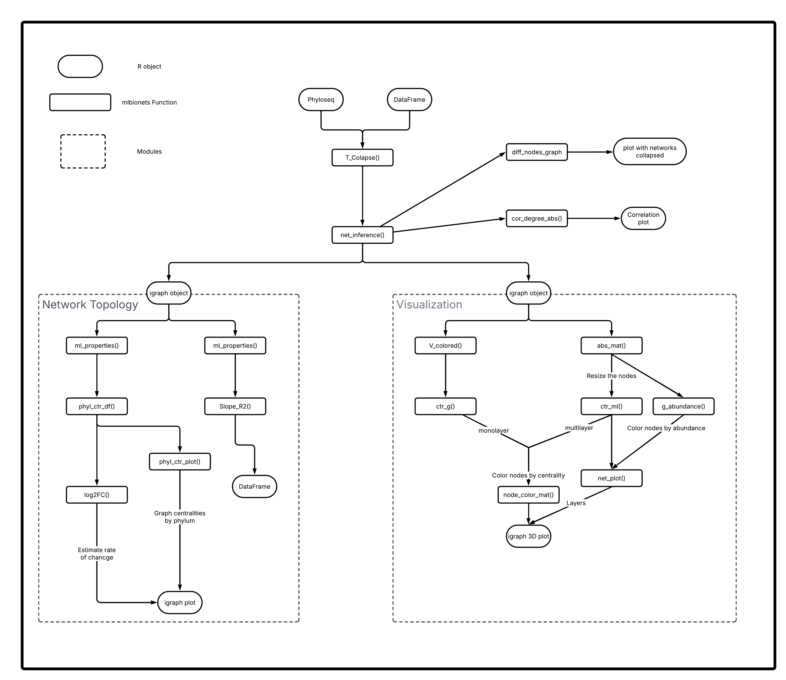

mlBioNets
================

<!-- README.md is generated from README.Rmd. Please edit that file -->

# mlBioNets

<!-- badges: start -->

[](https://github.com/Nertekkad/mlBioNets/issues)
[](https://github.com/Nertekkad/mlBioNets/pulls)
[](https://lifecycle.r-lib.org/articles/stages.html#experimental)
[](https://github.com/Nertekkad/mlBioNets/actions/workflows/check-bioc.yml)

<!-- badges: end -->

**\*\*mlBionets\*\*** is an R package designed to comprehensively
analyze microbiota data using a multilayer network approach. This
package enables researchers to integrate and analyze multiple types of
biological data, providing a robust framework for studying complex
microbial communities and their interactions within different
environmental and biological contexts.

**Features**

- **Multilayer Network Construction:** Build and visualize multilayer
  networks from microbiota data, incorporating various layers such as
  phylogenetic, functional, and environmental information.

- **Data Integration:** Seamlessly integrate different types of
  microbiota data, including taxonomic profiles and metadata

- **Advanced Analysis Tools:** Perform network-based analyses, including
  community detection, network centrality, and inter-layer connectivity.

- **Visualization:** Generate publication-quality visualizations to
  illustrate complex network structures and interactions.

- **Customizable Workflows:** Easily customize analysis workflows to
  suit specific research needs, facilitating reproducible and flexible
  data analysis.

## Installation instructions

You can install the development version of mlBioNets like so:

``` r
devtools::install_github("Nertekkad/mlBioNets")
#> Downloading GitHub repo Nertekkad/mlBioNets@HEAD
#> Installing package into '/home/karelvazquez/R/x86_64-pc-linux-gnu-library/4.4'
#> (as 'lib' is unspecified)
library(mlBioNets)
```

## OsX users

Before installing the mlBioNets package, it is necessary to install some
gfortran packages, so that it can work better, since it is necessary to
compile the source code, which seems to generate problems for mac users.

It is recommended to get
[gfortan](https://developer.apple.com/downloads/index.action?=command%20line%20tools)
[from](httpshttps://developer.apple.com/downloads/index.action?=command%20line%20tools://kingaa.github.io/mac-fortran.html)
[xcode](https://developer.apple.com/downloads/index.action?=command%20line%20tools)
by running the following code in a terminal (OSX 10.10 and later):

``` bash
xcode-select --install
```

Alternatively, the officially-supported fortran binaries [are on
CRAN](https://cran.r-project.org/bin/macosx/tools/).

## Overview of the design and workflow with mlBioNets package



## Citation

Below is the citation output from using `citation('mlBioNets')` in R.
Please run this yourself to check for any updates on how to cite
**mlBioNets**.

``` r
print(citation('mlBioNets'), bibtex = TRUE)
#> To cite package 'mlBioNets' in publications use:
#> 
#>   Lázaro-Vidal V, Hernández-Zendejas V, Vázquez-Suárez K,
#>   Álvarez-Martínez R (2025). _mlBioNets_.
#>   doi:10.18129/B9.bioc.mlBioNets
#>   <https://doi.org/10.18129/B9.bioc.mlBioNets>,
#>   https://github.com/Nertekkad/mlBioNets/mlBioNets - R package version
#>   0.1.0, <http://www.bioconductor.org/packages/mlBioNets>.
#> 
#> A BibTeX entry for LaTeX users is
#> 
#>   @Manual{,
#>     title = {mlBioNets},
#>     author = {Víctor Lázaro-Vidal and Valeria Hernández-Zendejas and Karel Vázquez-Suárez and Roberto Álvarez-Martínez},
#>     year = {2025},
#>     url = {http://www.bioconductor.org/packages/mlBioNets},
#>     note = {https://github.com/Nertekkad/mlBioNets/mlBioNets - R package version 0.1.0},
#>     doi = {10.18129/B9.bioc.mlBioNets},
#>   }
#> 
#>   Lázaro-Vidal V, Hernández-Zendejas V, Vázquez-Suárez K,
#>   Álvarez-Martínez R (2025). "mlBioNets: A multilayer network approach
#>   for microbiota data analysis." _bioRxiv_. doi:10.1101/TODO
#>   <https://doi.org/10.1101/TODO>,
#>   <https://www.biorxiv.org/content/10.1101/TODO>.
#> 
#> A BibTeX entry for LaTeX users is
#> 
#>   @Article{,
#>     title = {mlBioNets: A multilayer network approach for microbiota data analysis},
#>     author = {Víctor Lázaro-Vidal and Valeria Hernández-Zendejas and Karel Vázquez-Suárez and Roberto Álvarez-Martínez},
#>     year = {2025},
#>     journal = {bioRxiv},
#>     doi = {10.1101/TODO},
#>     url = {https://www.biorxiv.org/content/10.1101/TODO},
#>   }
```

Please note that the `mlBioNets` was only made possible thanks to many
other R and bioinformatics software authors, which are cited either in
the vignettes and/or the paper(s) describing this package.

## Code of Conduct

Please note that the `mlBioNets` project is released with a [Contributor
Code of Conduct](http://bioconductor.org/about/code-of-conduct/). By
contributing to this project, you agree to abide by its terms.
